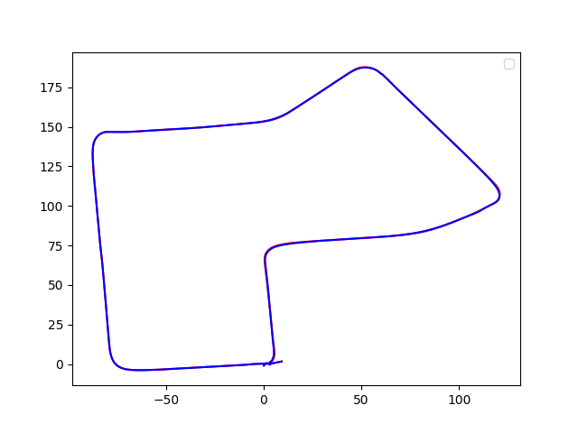

# artpark-internship-2021
All code related to summer internship projects 2021

# Integration of [OverlapNet](https://github.com/PRBonn/OverlapNet) with GraphSLAM 

## Dependencies
- System dependencies:

  ```bash
  sudo apt-get update 
  sudo apt-get install -y python3-pip python3-tk
  sudo -H pip3 install --upgrade pip
  ```

- Python dependencies (may also work with different versions than mentioned in the requirements file)

  ```bash
  sudo -H pip3 install -r requirements.txt
  ```
- [g2opy](https://github.com/uoip/g2opy)

## How to use
You need to first download several data:
- pre-trained [model](https://www.ipb.uni-bonn.de/html/projects/overlap_net/model_geo.weight), 
- KITTI odometry [data](https://www.ipb.uni-bonn.de/html/projects/overlap_net/kitti_07.zip), where we also provide the covariance information generated from the SLAM, 
- pre-processed [data](https://www.ipb.uni-bonn.de/html/projects/overlap_net/preprocess_07.zip).

If you follow the recommended [data structure](#data-structure) below, you extract the downloaded data into the folder `data`
```bash
data
    ├── 07
    │   ├── calib.txt
    │   ├── covariance.txt
    │   ├── poses.txt
    │   ├── depth
    │   │   ├── 000000.npy
    │   │   ├── 000001.npy
    │   │   └── ...
    │   ├── normal
    │   │   ├── 000000.npy
    │   │   ├── 000001.npy
    │   │   └── ...
    │   ├── velodyne
    │   │   ├── 000000.bin
    │   │   ├── 000001.bin
    │   │   └── ...
    │   └── ground_truth
    │       ├── ground_truth_overlap_yaw.npz
    │       ├── test_set.npz
    │       └── train_set.npz
    └── model_geo.weight
```
- Run the demos 1 to 3 in the demo folder as described in the [OverlapNet repository](https://github.com/PRBonn/OverlapNet) and see if you are able to get the plots.
- Now run the `demo/overlap_integration_with_graphslam.py` file and verify if you are able to get the plots as shown below. (Note: working of g2o on your system is crucial for this step. Run the `src/g2o_test.ipynb` notebook to check if g2o is working properly on your system)


## Todo
* Add script for converting velodyne data in different formats to .bin to increase compatibility 
* Add code for visualizing the map by plotting the lidar points 
* Test on a large dataset with loop closures
* Improve translational part of the pose transform matrix between loop closure vertices
  
